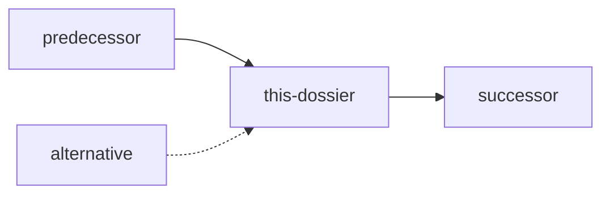

# Dossier Metadata Section Template

Use this template when adding metadata to dossiers.

---

## 📋 Metadata

### Version
- **Dossier**: v[MAJOR].[MINOR].[PATCH]
- **Protocol**: v[PROTOCOL_VERSION]
- **Last Updated**: YYYY-MM-DD

### Relationships

**Preceded by** (what typically runs before this):
- [dossier-name](./dossier-name.md) - [Why/when] ([optional|required])

**Followed by** (what typically runs after this):
- [dossier-name](./dossier-name.md) - [Purpose] ([suggested|required])

**Alternatives** (different ways to achieve similar goals):
- [dossier-name](./dossier-name.md) - [When to use instead]

**Conflicts with** (cannot both apply):
- [dossier-name](./dossier-name.md) - [Reason for conflict]

**Can run in parallel with**:
- [dossier-name](./dossier-name.md) - [If applicable]
- None (if must run alone)

**Relationship Graph**:


### Outputs

**Files created**:
- `path/to/file` - Description (required|optional)
- `directory/` - Purpose

**Configuration produced** (consumed by other dossiers):
- `config.key` - Used by: [dossier1], [dossier2]

**State changes**:
- Description of state change
- Affects: [what it impacts]

**Agents/Scripts generated** (if applicable):
- `path/to/script` - Purpose and usage

### Inputs

**Required**:
- Input name - Description and validation

**Optional**:
- Input name - Description and default behavior

**From other dossiers** (if applicable):
- [source-dossier] → `output_name` - Usage

### Coupling

**Level**: [Tight|Medium|Loose|None]

**Coupling points**:
- Shared file/config dependency
- State dependency
- Interface dependency

**Decoupling strategies**:
- How this dossier can run independently
- Fallback behaviors
- Alternative approaches

---

## Usage

### Minimal Metadata (Quick Start)
```markdown
## 📋 Metadata

**Version**: 1.0.0
**Preceded by**: [previous-dossier]
**Followed by**: [next-dossier]
**Outputs**: file1, file2, directory/
**Coupling**: Medium
```

### Complete Metadata (Full Documentation)
Include all sections above with comprehensive details.

---

## When to Update Metadata

- When dossier version changes
- When relationships change
- When outputs are added/modified
- When new dossiers reference this one
- After self-improvement suggestions accepted
